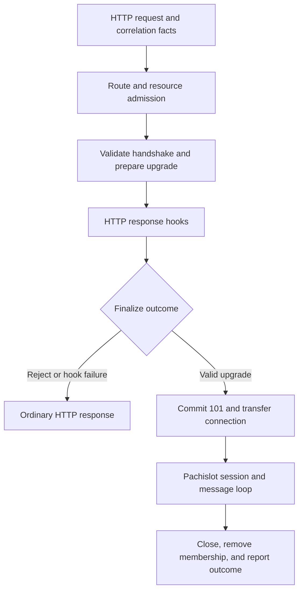

# Correlation extensions and Pachislot integration

- Status: proposed; neither extension nor the Peregrine framework is implemented
  here.
- Date: 2026-09-21.
- Audience: Peregrine and Pachislot implementers and application authors.
- Decision: [ADR 005](adr-005-extension-and-upgrade-boundaries.md).

## 1. Direction and evidence

Accommodate falcon-correlate through configurable correlation policy and
outbound propagation adapters. Accommodate Pachislot through a typed HTTP
upgrade boundary, followed by a separately owned WebSocket runtime. Both share
application services and observability values without sharing mutable HTTP
contexts across lifetimes.

Interpret the requested sidecar as a companion Rust library inside the same
Peregrine service: the same listener, application composition root, and
injected ports. A separate process would need a transport and identity-transfer
contract and is not assumed. Pachislot is the intended compatible successor to
falcon-pachinko, not a Python API emulation layer.

The source review used falcon-correlate commit
`0a95d8cd4990194141cd424b038406eb30162823` and falcon-pachinko commit
`a27daef6dd298ad964108a62385da6e333575bbe`, fetched from their remote default
branches on 2026-09-21. Source checkouts were inspected without modifying their
working files. No consumer runtime or compatibility suite was run.

### 1.1. What the extensions actually provide

| Extension                     | Observed implementation                                                                                                                   | Consequence for Peregrine                                                                                        |
| ----------------------------- | ----------------------------------------------------------------------------------------------------------------------------------------- | ---------------------------------------------------------------------------------------------------------------- |
| falcon-correlate              | Configurable header, UUIDv7 generator, optional validator, trusted address/network set, response echo switch, and request-local context.  | Configure the existing engine-owned request facts; avoid a second correlation authority.                         |
| falcon-correlate integrations | Logging enrichment, synchronous/asynchronous HTTPX propagation, and Celery publish/worker context handling.                               | Optional tracing, HTTP-client, and job adapters around transport-independent correlation values.                 |
| falcon-pachinko routing       | Named routes, per-connection resource factories, nested resources, inherited state, and dependency factories.                             | Shared endpoint descriptors construct owned session entities; registration names remain distinct from addresses. |
| falcon-pachinko messages      | Tagged `msgspec` schema dispatch or a `{type, payload}` envelope, registered/conventional handlers, and `on_unhandled`.                   | Explicit codecs and typed operation registration, with fixtures for both wire modes.                             |
| falcon-pachinko lifecycle     | Layered connection/receive hooks, disconnect interfaces, connection/room backend, bounded-send broadcast option, workers, and simulators. | Pachislot owns message hooks, sessions, writers, room membership, and worker integration.                        |

_Table 1: Implemented extension capabilities, not inferred roadmap promises._

Correlation defaults are `X-Correlation-ID`, no trusted sources, no validator,
and response echo enabled. The generator returns UUIDv7 hexadecimal text
without hyphens. Incoming values are stripped; a trusted, non-empty value is
accepted when validation is absent or passes. Otherwise a new value is
generated.[^1] HTTPX propagation preserves an explicit header. Celery normally
replaces its publish correlation property with the active request ID, but
preserves the task ID for its `rpc://` result backend.[^2]

Pachinko's router negotiates a connection and returns; its dispatch API is
separate. Reference behaviour tests explicitly call both. This review does not
establish an integrated production receive loop from those tests. Its router
calls `on_connect` before its own final `accept`, despite wording in one method
docstring. Compatibility work must establish observable behaviour through
socket tests and distinguish library components from example glue.[^3]

Pachinko's chat design describes AsyncAPI as a design artefact. The inspected
router and dispatcher do not load AsyncAPI documents. A document loader or
schema generator is therefore additional Pachislot scope, rather than an
existing runtime capability that must be copied for compatibility.

The code has before/after connect, before/after receive, and before-disconnect
hook events. Reverse traversal reverses resource layers, not registration order
inside each layer. A failing before-receive hook prevents after-receive hooks;
cancellation does not run that after path. This differs from Peregrine's
independent HTTP response hooks. Do not promise the same semantics merely
because both designs have middleware.[^4]

## 2. Package and ownership boundaries

Candidate package boundaries are conceptual; publishing names and crate splits
remain open. A single optional integration module is sufficient for the first
prototype.

| Boundary                     | Owns                                                                                                              | Does not own                                                        |
| ---------------------------- | ----------------------------------------------------------------------------------------------------------------- | ------------------------------------------------------------------- |
| Peregrine core               | Request facts, resource identity and policy, response finalization, validated upgrade outcome.                    | AsyncAPI documents, message codecs, rooms, or workers.              |
| Peregrine HTTP adapter       | HTTP/1.1 handshake transport, one-shot upgrade capability, tracked hand-off and connection accounting.            | Domain messages or operation dispatch.                              |
| Correlation policy/adapters  | Value selection, trust/validation configuration, tracing enrichment, outbound propagation.                        | Authentication, task identity, or a global mutable current request. |
| Pachislot                    | Channel/operation registry, codecs, session entities, message lifecycle, connection manager, and bounded writers. | HTTP middleware replay or application transaction ownership.        |
| Application composition root | Services, connection policy, worker startup/shutdown, backend choices, and compatible schema profile.             | Hidden framework dependency lookup.                                 |

_Table 2: Extension boundaries and reuse limits._

Peregrine depends on an upgrade capability interface, not on Pachislot.
Pachislot's Peregrine adapter depends on that interface and Pachislot's session
runtime. Domain ports depend on neither. Share small owned identity and
correlation projections deliberately; do not introduce a universal application
context or service container.

## 3. Correlation as policy, facts, and propagation

The proposed `CorrelationPolicy` is configured at application construction and
called by the engine before request hooks. It selects a validated opaque
`CorrelationId` from repeated-header-aware input and transport peer facts, or
generates one. The selected value becomes immutable `RequestFacts`.

Expose header name, trusted peer/network policy, generator, validator, and echo
configuration. A Falcon-compatible profile accepts or replaces IDs according to
the observed rules above. A stricter rejection profile is explicit: rejection
still receives a generated ID and an ordinary failure response. Always enforce
bounded, header-safe values, including generator output. Record that safety
constraint and duplicate-header decisions as deliberate differences where the
Python configuration was more permissive. Do not silently require a UUID
validator when the compatible default accepts other trusted strings.

Use the transport peer for trust unless the application explicitly configures
trusted proxy interpretation. A caller-supplied forwarding header cannot make
its own correlation ID trusted. No correlation value grants tenant authority.
Keep it distinct from a tracing span ID, message ID, and job ID.

The engine applies the configured echo policy during finalization, including
ordinary errors, early responses, supervised timeouts, and successful upgrade
handshakes. A missing response hook cannot lose correlation. Pre-context parser
failures remain outside this guarantee. Rendering may still include correlation
in its body when header echo is disabled; the switch controls the header only.

Use explicit values in application calls and owned snapshots for spawned work.
Optional task-local access is scoped around a future, with `tracing`
instrumentation across polls; do not hold an entered-span guard across awaits.
Cancellation must end the scope without depending on response hooks. New tasks,
worker messages, and upgraded sessions require explicit propagation rather than
assumed inheritance of a Python `ContextVar`.

Outbound HTTP adapters preserve explicit caller headers, including repeated
values, and add correlation only when absent. Job adapters specify their own
carrier contract; a Celery-compatible adapter must preserve the `rpc://`
exception. This is optional integration, not a requirement for Peregrine to
embed HTTPX, Celery, or a broker.

## 4. The HTTP-to-WebSocket hand-off

### 4.1. A distinct endpoint kind and final outcome

Introduce an optional upgrade endpoint kind with the same frozen resource
identity, route parameters, and admission-policy surface as an HTTP resource.
It is registered explicitly. For the initial WebSocket binding it accepts a
validated HTTP/1.1 GET upgrade; it does not acquire automatic HEAD behaviour
from an ordinary GET responder. OPTIONS describes the endpoint without opening
a session. A plain GET without a valid handshake is an ordinary HTTP rejection.
HEAD, incompatible methods, invalid headers, and unsupported subprotocols never
start a session. Specify their exact statuses and headers in the prototype.

Resolve the channel and any nested descriptor chain before final admission;
policy must see that destination rather than only a generic `/ws` mount. Freeze
that selection through hand-off. Pachinko's first-match route order and slash
normalization cannot be assumed equivalent to Peregrine's router. The adapter
must preserve them for its declared profile or reject incompatible registration
at startup. Post-upgrade routing must not substitute a different endpoint.

Conceptually, finalization selects `HttpResponse` or `UpgradePlan`. An
application cannot manufacture a valid plan by setting status 101 or placing an
arbitrary callback in request extensions. The plan owns a one-shot transport
capability, the validated handshake, immutable connection facts, and a session
factory. It holds no borrow of the HTTP request, context, or body.



_Figure 1: HTTP hooks finish at the handshake; Pachislot owns the subsequent
session._

Request hooks and resource policy run before upgrade preparation. HTTP response
hooks run once before commitment; a failure or response replacement invalidates
the pending plan and releases its reservations. The finalizer alone emits the
validated 101 and mandatory handshake headers. Hooks may add permitted headers
but cannot corrupt handshake fields or attach an HTTP body to the upgrade.
Body-transforming middleware sees the endpoint/outcome kind and must skip
inapplicable transformations. Rejections still use the normal error renderer.

A preflight session preparation stage may validate connection parameters and
reserve capacity. It cannot write WebSocket frames. Observable sends and room
publication start only after successful transfer. This is cleaner than exposing
an `accept()` method to every hook; any legacy pre-accept sends need a
documented compatibility treatment, not accidental double acceptance.

### 4.2. Transport and shutdown obligations

Hyper supplies `OnUpgrade` and an owned upgraded connection, but leaves
handshake validation to the caller. Its HTTP/1 connection driver must
explicitly enable upgrades.[^5] Never await the upgrade before returning the
handshake response: the driver needs that response to complete the transition.

Reserve session capacity before committing 101. Register the pending hand-off
with a supervisor before returning it, and activate the session only when
`OnUpgrade` resolves successfully. Failure, disconnect, or cancellation
releases the reservation without starting message dispatch. Preserve any bytes
already buffered by the HTTP parser when handing the stream to the WebSocket
codec. The raw upgraded stream itself is not a WebSocket frame codec.

Release the HTTP execution permit when the handshake ends, but retain
connection/session accounting until the upgraded session ends. HTTP connection
completion must not make upgraded sockets invisible to shutdown. The server
stops new handshakes; the application stops message-producing workers;
Pachislot closes/drains sessions to a deadline and reports leftovers before
shared adapters are released. Close failure and forced cancellation remain
observable. An asynchronous disconnect hook is not guaranteed after process
death.

Only HTTP/1.1 upgrade is proposed here. HTTP/2 extended CONNECT, native TLS,
and proxy deployment requirements need separate decisions. The application owns
Origin, cookie/token, and subprotocol policy. Browser clients cannot generally
set arbitrary handshake headers; choose a compatible authentication mechanism
and test it rather than assuming HTTP bearer middleware always suffices.

## 5. AsyncAPI semantics and entity mapping

Use AsyncAPI 3.0 as an explicit initial contract target. Its channel key,
channel address, message key/name, and operation key have distinct identities.
A message discriminator on the wire is another explicit mapping; it must not be
inferred from a Rust type name. `receive` means the described application
receives; `send` means it sends.[^6]

| AsyncAPI concept                            | Pachislot interpretation                                                          |
| ------------------------------------------- | --------------------------------------------------------------------------------- |
| Channel key, such as `roomEvents`           | Stable channel descriptor and entity factory registration name.                   |
| Channel address, such as `/ws/rooms/{room}` | WebSocket endpoint template and validated connection parameters.                  |
| Channel instance                            | Connection-scoped entity/session with owned state and injected application ports. |
| Channel message definition                  | Codec registration and typed message value; wire tag recorded explicitly.         |
| Receive operation                           | Typed inbound operation implementation on the entity.                             |
| Send operation                              | Typed emission capability available to authorized handlers or workers.            |
| Operation trait                             | Reusable AsyncAPI metadata merged by the specification's rules.                   |

_Table 3: AsyncAPI-to-Pachislot mapping from the server application's
viewpoint._

AsyncAPI operation traits are metadata, not Rust traits. They cannot supply
`action`, `channel`, `messages`, or another `traits` list. Rust operation
traits provide executable capabilities; their registered descriptors connect
them to AsyncAPI operations. Security metadata requires a runtime enforcement
binding; a document alone cannot authorize an operation.[^6]

The standard WebSocket binding models a channel as the connection, with HTTP
handshake metadata; it does not define virtual-channel multiplexing.[^7] Start
with one resolved channel per socket, carrying several named message types. A
room is a delivery group, not automatically an AsyncAPI channel. If a single
`/ws` socket must carry many logical channels, define a versioned subprotocol
with channel selection, subscriptions, per-channel authorization, and an
envelope field. Document that as an extension, not standard binding behaviour
or an invisible change to Pachinko's envelope.

Choose one canonical registry of channel, message, operation, and policy
bindings. For the first prototype, explicit typed registration produces or is
checked against an AsyncAPI document. Do not maintain unrelated runtime and
schema routing tables. A schema-first generator can be a later authoring tool;
full document interpretation is not required in the request path. Unsupported
schema features fail validation or are explicitly out of the supported profile.

Validate unique registrations, operation direction, message membership in the
referenced channel, unambiguous wire tags, and schema/codec parity. Invalid
payloads must not fall through to a different privileged handler. Freeze the
registry before serving; erase typed dispatch only at the heterogeneous lookup
boundary. AsyncAPI permits broader arrangements; any one-handler-per-inbound-
message restriction is a declared Pachislot profile constraint.

### 5.1. Illustrative operation registration

The following is proposed syntax, not a compiled or published API. Here
`RoomEntity` is a factory for an owned session; application services behind it
remain independent of both frameworks.

```rust
let rooms = Channel::new("roomEvents", "/ws/rooms/{room}")
    .entity(RoomEntity::new(chat_service))
    .receive::<PostMessage>("postMessage", "chat.post")
    .emit::<MessagePosted>("messagePosted", "chat.posted")
    .codec(PachinkoEnvelope::new());

let sockets = Pachislot::builder().channel(rooms).build()?;
let app = PeregrineApp::builder()
    .correlation(correlation_policy)
    .mount_upgrade(sockets.peregrine_endpoint())
    .build()?;
```

The corresponding operation fragment uses channel-message references. The
channel and component definitions are omitted here; this is not a complete
AsyncAPI document.

```yaml
operations:
  postMessage:
    action: receive
    channel:
      $ref: '#/channels/roomEvents'
    messages:
      - $ref: '#/channels/roomEvents/messages/postMessage'
  messagePosted:
    action: send
    channel:
      $ref: '#/channels/roomEvents'
    messages:
      - $ref: '#/channels/roomEvents/messages/messagePosted'
```

A Rust `Receive<PostMessage>` implementation gets a bounded message context,
the decoded value, and typed output capabilities. An `Emit<MessagePosted>`
capability limits which outbound message a producer can send; it need not force
every event into a request/reply return value. Replies, broadcasts, and
worker-generated events are separate supported patterns. Associated session
state is mutable only within the owning session's execution; application
services are normally shared through `Arc`.

Do not automatically make Rust's native async operation traits into trait
objects. Generic authoring plus a boxed-future invocation adapter is the
baseline to measure. Polonius may help local borrowing, but cannot make a
borrowed HTTP context survive an upgrade or supply missing `Send` bounds.

## 6. Session, message, and correlation lifetimes

Shared endpoint descriptors are `Send + Sync`; a session may be owned and
`Send` without requiring shared mutable access or `Sync`. Start with serial
message handling per connection. Bounded owned commands can enable concurrency
later with explicit ordering and cancellation semantics.

Pachislot has its own raw-receive hooks and entity/operation admission stage.
Resolve and validate an operation before invoking application code. Connect
admission is not authorization for every future message: recheck tenant,
operation, room membership, and credential expiry/revocation according to the
application's policy. Outbound fan-out needs recipient authorization too. Keep
HTTP policy and message policy distinct, with shared application policy
services where appropriate.

Compatibility hooks reproduce Pachinko's observed layer order and failure
rules; a richer message-policy hook is explicitly additional. After commitment,
errors become application messages or WebSocket closes according to the
selected profile, never an HTTP JSON error or status change. Unknown messages
preserve `on_unhandled` behaviour unless the application selects a stricter
profile.

Use one bounded writer per connection and cloneable send handles for producers.
Specify whether send completion means queued, written, or acknowledged; these
are different guarantees. For compatible room broadcasts, wait for the defined
send result, attempt the selected snapshot, and aggregate per-recipient errors.
Do not silently convert errors into best-effort success. No registry lock is
held across network sends. Bound messages, queues, room size, broadcast
concurrency, handler time, idle time, and close time.

The in-process backend holds local send handles. A future distributed backend
routes to an owning process; it cannot store live WebSocket objects in a remote
database. Delivery persistence, replay, ordering across processes, and exactly-
once claims require independent contracts. Worker startup/shutdown stays at the
application root; a Pachislot worker supervisor can be explicitly owned there
without extending HTTP request middleware.

Copy the handshake correlation into immutable connection facts. Give each
received message a local message ID and separately resolve its conversation
correlation/causation metadata. AsyncAPI's correlation location describes an
application message field, not a requirement to reuse the HTTP header. It
neither mandates a new envelope nor defines distributed tracing. Preserve
existing payloads: do not add a required ID field to a compatibility codec. If
no wire ID exists, internal diagnostics can still link message and connection.

Explicitly propagate the chosen message correlation into application calls,
outbound HTTP, and jobs. Broadcasts carry their initiating event's context;
periodic workers start their own context. Never pick up the last connected
user's ambient context. Connection duration, message outcome, transfer failure,
and durable application effects have separate telemetry, with bounded channel
and operation names as labels, not connection or correlation identifiers.

## 7. Compatibility and experimental gates

Compatibility has three parts: unchanged-client wire behaviour, application
capabilities, and lifecycle semantics. Rust deserialization must reproduce the
selected codec's missing/null payload, extra-field, coercion, and numeric-range
rules; deriving a superficially similar type does not establish wire parity.
Python decorators and mutable app patching need not be reproduced. The selected
profile must state both preserved behaviours and intentional differences before
claiming compatibility.

| Experiment                         | Required evidence and rejection condition                                                                                                                                                                                                                                                                                                                                       | Roadmap      |
| ---------------------------------- | ------------------------------------------------------------------------------------------------------------------------------------------------------------------------------------------------------------------------------------------------------------------------------------------------------------------------------------------------------------------------------- | ------------ |
| X1: Correlation policy parity      | Fixtures cover UUIDv7 hex generation, trust/CIDR matching, whitespace, absent validator, invalid IDs, echo off, duplicate headers, generator failure, outbound override, and Celery RPC behaviour. Reject a profile that silently changes accepted IDs or loses context on error/cancellation.                                                                                  | 1.4.1; 3.1.3 |
| X2: Safe upgrade boundary          | Compile-pass owned session state and compile-fail borrowed request escape; socket tests cover rejected policy, HEAD/OPTIONS, malformed handshake, hook failure, 101 hand-off, failed upgrade, buffered first frame, admission saturation, and shutdown. Reject any message dispatch before transfer or untracked upgraded socket.                                               | 1.4.1; 7.3.1 |
| X3: Pachinko compatibility         | A shared fixture corpus covers both codecs, validation, unknown messages, path/trailing-slash precedence, nested parameters/state, hook ordering/failures, connect/close, room snapshot/exclusion/errors, and worker failure/shutdown. Run the same client traces against explicit Python reference glue and Pachislot. Record gaps rather than assuming examples prove parity. | 7.3.2        |
| X4: AsyncAPI coherence             | Validate generated documents and registry agreement, missing/ambiguous mappings, direction, operation traits, reply/correlation declarations, and per-operation authorization. Reject a separate hand-maintained runtime routing table or an undocumented multiplexing protocol.                                                                                                | 7.3.2        |
| X5: Resource and context isolation | Simultaneous sessions, message cancellation, stalled writers, fan-out failures, and shutdown preserve bounds and never leak identity/correlation. Compare HTTP and message invocation of one application use case.                                                                                                                                                              | 7.3.3        |

_Table 4: Planned experiments; source inspection alone completes none of them._

Axioms: protocol commitment is irreversible; application authority is separate
from correlation; every long-lived task has an owner; application ports remain
transport-independent. Assumptions: in-process hosting, HTTP/1.1 first, one
channel per socket initially, and explicit registration before
schema-generation conveniences. Revise these if the compatibility corpus
requires multiplexing, other transports, or a different operation model. Exact
limits, close/error mappings, compatibility version, and publication layout
remain open decisions.

## 8. References

[^1]: falcon-correlate
      [configuration](https://github.com/leynos/falcon-correlate/blob/0a95d8cd4990194141cd424b038406eb30162823/src/falcon_correlate/middleware_config.py),
    [middleware](https://github.com/leynos/falcon-correlate/blob/0a95d8cd4990194141cd424b038406eb30162823/src/falcon_correlate/middleware.py),
    and [generation/context utilities](https://github.com/leynos/falcon-correlate/blob/0a95d8cd4990194141cd424b038406eb30162823/src/falcon_correlate/middleware_utils.py).

[^2]: falcon-correlate
      [HTTPX adapter](https://github.com/leynos/falcon-correlate/blob/0a95d8cd4990194141cd424b038406eb30162823/src/falcon_correlate/httpx.py)
    and [Celery adapter](https://github.com/leynos/falcon-correlate/blob/0a95d8cd4990194141cd424b038406eb30162823/src/falcon_correlate/celery.py).

[^3]: falcon-pachinko
      [router](https://github.com/leynos/falcon-pachinko/blob/a27daef6dd298ad964108a62385da6e333575bbe/falcon_pachinko/router.py),
    [dispatcher](https://github.com/leynos/falcon-pachinko/blob/a27daef6dd298ad964108a62385da6e333575bbe/falcon_pachinko/dispatcher.py),
    [reference behaviour driver](https://github.com/leynos/falcon-pachinko/blob/a27daef6dd298ad964108a62385da6e333575bbe/tests/behaviour/test_reference_example_steps.py),
    and [design discussion](https://github.com/leynos/falcon-pachinko/blob/a27daef6dd298ad964108a62385da6e333575bbe/docs/falcon-websocket-extension-design.md).

[^4]: falcon-pachinko
      [resources](https://github.com/leynos/falcon-pachinko/blob/a27daef6dd298ad964108a62385da6e333575bbe/falcon_pachinko/resource.py),
    [hooks](https://github.com/leynos/falcon-pachinko/blob/a27daef6dd298ad964108a62385da6e333575bbe/falcon_pachinko/hooks.py),
    [connection backend and broadcast](https://github.com/leynos/falcon-pachinko/blob/a27daef6dd298ad964108a62385da6e333575bbe/falcon_pachinko/websocket.py),
    and [worker lifecycle](https://github.com/leynos/falcon-pachinko/blob/a27daef6dd298ad964108a62385da6e333575bbe/falcon_pachinko/workers.py).

[^5]: Hyper 1.11.1
      [upgrade module](https://docs.rs/hyper/1.11.1/hyper/upgrade/index.html)
    and [HTTP/1 upgrade support](https://docs.rs/hyper/1.11.1/hyper/server/conn/http1/struct.Connection.html#method.with_upgrades).

[^6]: [AsyncAPI 3.0 specification](https://www.asyncapi.com/docs/reference/specification/v3.0.0),
    channel, operation, operation-trait, reply, and correlation definitions.
    Registry restrictions and Rust operation traits above are Pachislot proposals.

[^7]: [AsyncAPI WebSocket binding 0.1.0](https://github.com/asyncapi/bindings/blob/master/websockets/README.md),
    checked with Firecrawl on 2026-09-21 alongside the specification and Hyper
    documentation. Pin the binding source with the implementation fixture corpus.
