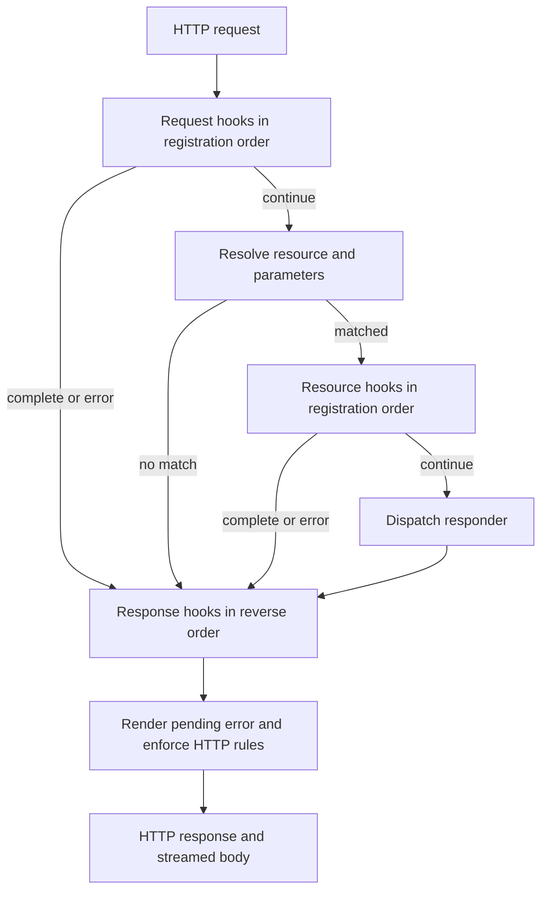

# Peregrine Web technical design

- Status: proposed v0.2; describes a target, not implemented functionality.
- Date: 2026-09-20.
- Audience: library implementers, API reviewers, and service maintainers.
- Scope: a resource-oriented HTTP framework with an explicit middleware engine.
- Authority: [terms of reference](terms-of-reference.md) establishes goals;
  [ADR 001](adr-001-resource-aware-lifecycle.md) records the proposed core
  choice.
- Delivery: [potential GIST roadmap](roadmap.md), including the key
  [compiler/ownership experiment](polonius-ownership-experiment.md) and
  [ADR 002](adr-002-compiler-ownership-experiment.md).

## 1. Problem, evidence, and design boundaries

Peregrine keeps endpoint operations, dependencies, and policy on resource
objects. Routing exposes the selected object to middleware before dispatch. A
mutable context carries request state and the developing response through a
framework-owned lifecycle. This preserves the central requirements of the
project brief and the accompanying architectural paper.[^1]

The repository currently contains a library stub and no runtime dependencies.
Every interface below is a proposed contract. The compiler experiment records
measured acceptance of isolated examples; no framework benchmark, deployment
compatibility claim, or runnable framework example is implied.

The initial delivery target is a single `peregrine-web` library, in-process
request execution, and an HTTP/1.1 serving adapter. Buffered convenience and
streaming belong in the core release. HTTP/2, native Transport Layer Security
(TLS), WebSockets, hot route reload, and a supported Tower adapter are deferred
pending the scope decisions in terms of reference §9. A deployment can supply
secure ingress externally; trusted forwarding configuration remains explicit.

### 1.1. Reconciliation of the source papers

| Source detail                                                                    | Proposed interpretation or correction                                                                               |
| -------------------------------------------------------------------------------- | ------------------------------------------------------------------------------------------------------------------- |
| `Resource`, `FalconResource`, and `PeregrineMiddleware` names                    | Use `Resource` and `Middleware`; Falcon names describe inspiration, not compatibility.                              |
| Resource marker-trait inspection                                                 | Expose a typed policy method on `Resource`; do not assume a trait object can discover unrelated implemented traits. |
| Unsupported responders return either success with status 405 or a semantic error | Use a semantic failure, with explicit method metadata supplying `Allow`.                                            |
| Parameter examples use `/users/:id`                                              | Use `/users/{id}` for the selected current `matchit` syntax.                                                        |
| Copying parameters is labelled zero-copy                                         | Owned parameter strings allocate; retain the simple ownership boundary until measurement justifies a change.        |
| `Request<Incoming>` is described as optional and replayable                      | Separate request metadata from an explicit single-consumer body state.                                              |
| Response ordering is configurable or reverse by default                          | Propose one reverse-order policy for the initial release.                                                           |
| Dispatch cost is described as negligible                                         | Treat its magnitude as an untested hypothesis; benchmark allocation and tail latency.                               |

_Table 1: Source reconciliation; new choices remain proposed._

### 1.2. Ecosystem constraints

Falcon documents independent response middleware and post-routing resource
hooks; these inform the design without promising identical behaviour.[^2]
Hyper's server guide supplies the service/connection boundary and Tokio I/O
adaptation.[^3] `matchit` supplies path matching, parameter extraction, and
registration conflict detection.[^4]

Rust's dyn-compatibility rules constrain async resource objects. The
`async-trait` transformation supplies boxed `Send` futures; sharing resources
requires `Send + Sync`, while moving request futures between threads requires
`Send`. Request-local state need not be shared concurrently.[^5] These are
separate obligations, not a claim that all async state must be `Sync`.

Tower composition remains an alternative, but it does not by itself define
Peregrine's resource visibility or phase semantics. The choice to own those
semantics is recorded in ADR 001. No claim that another framework is incapable
of resource-aware policy is necessary to justify this experiment.

## 2. Architecture and ownership

The application builder accepts resource registrations, an ordered middleware
list, and explicit configuration. `build` validates routes and configuration,
then freezes them into application state shared through `Arc`. Requests cannot
mutate this registry. Resources own their application dependencies; the
framework does not provide a dependency-injection container.

The pipeline borrows resources and middleware from immutable application state.
The baseline owns one context, passed sequentially as `&mut Context`. The
experiment in §3.1 instead loans narrower phase views from the same request
owner. Neither model requires a global context lock. Resource implementations
remain responsible for synchronizing their own shared mutable state and
avoiding blocking work on runtime threads.

The diagram shows normal progression and the exits into response processing.

_Figure 1: The pipeline owns phase transitions; all ordinary exits reach
response processing before finalization._

A streamed body is transferred only after finalization. Response hooks can
replace or wrap that body before transfer; they do not execute again when the
stream ends. Transport completion is a separate observability event.

| Component                  | Owned state and permitted responsibility                                        | Reuse boundary                                                      |
| -------------------------- | ------------------------------------------------------------------------------- | ------------------------------------------------------------------- |
| Application builder        | Route registration, middleware ordering, validated configuration.               | Startup only; not a request-time registry.                          |
| Router                     | Resource values and registered templates.                                       | Resolution only; never authorize or render responses.               |
| Pipeline                   | Phase state, matched resource reference, and failure progression.               | One engine for in-process and transport entrypoints.                |
| Context                    | Request metadata, body state, parameters, typed extensions, and response draft. | One request; no application-global storage.                         |
| Resource                   | Endpoint operations, method declaration, and typed policy.                      | Shared object; application dependency ownership stays here.         |
| Middleware                 | Cross-resource lifecycle behaviour.                                             | Hooks inspect context and resource contracts; no hidden rerouting.  |
| Body and response boundary | Bounded collection, stream ownership, error rendering, and HTTP finalization.   | Used by context operations and pipeline finalization.               |
| Server adapter             | Listener, admission, connection tasks, cancellation, and drain.                 | Invokes the same application operation; does not duplicate routing. |

_Table 2: Proposed component ownership and composition rules._

These are logical responsibilities, not a requirement for one module per row. A
repository sweep found no equivalent implementation beyond `src/lib.rs`'s stub.
Implementation should group modules by feature under the existing
[repository layout](repository-layout.md), keep files within repository limits,
and repeat the equivalence check before adding helpers. Extract another crate
only when an independently useful boundary has been demonstrated.

## 3. Application and context contracts

`PeregrineApp::handle` accepts an HTTP request whose body can be adapted to the
framework body interface. It asynchronously returns an HTTP response using the
same pipeline as the server. Recoverable application failures become responses;
body failures after commitment remain body-stream errors. The Hyper service can
therefore use `Infallible` as its service error without claiming that network
I/O or body transfer is infallible.

The input boundary must accept synthetic bodies for tests as well as Hyper's
`Incoming`. Type erasure happens once at that boundary. Bodies carry byte
frames and trailers, are `Send`, and do not require `Sync` solely for
concurrent request serving. A boxed body implementation meeting those bounds is
selected and compile-tested in the first spike; the conceptual `BoxBody` in the
source papers is not a complete type signature.

Context exposes request metadata for inspection, route parameters for reading,
mutable response operations, and typed extensions. Framework-owned lifecycle,
route selection, and error state stay private. `complete()` makes forward
completion monotonic; public code cannot clear it. Returning an error after
calling `complete()` still records a failure and overrides the success draft.

Pre-routing middleware may rewrite the effective URI through an explicit
operation. Preserve the original URI for diagnostics. Freeze the effective
method and route target before resource policy runs; resource and response
hooks cannot change the dispatch destination. In the baseline, parameters are
copied into owned strings before borrowing the context mutably again. This
avoids borrowing the URI inside the context across later mutations.

Request metadata survives body consumption. Typed extensions store application
state such as authenticated identity; absent identity is a normal condition
that policy must handle. No environment reads occur inside the pipeline.
Applications resolve configuration at startup and inject it.

### 3.1. Experimental compiler and ownership direction

**Key GIST idea:** a pure Polonius-plus-new-solver implementation may make
borrowing helpers and resource-aware middleware easier to express without
sacrificing entity-first ergonomics. [Roadmap phase 2](roadmap.md) tests this
before later slices commit to a public ownership model. The detailed
[experiment specification](polonius-ownership-experiment.md) contains paired
code examples, measured compiler results, attribution controls, and acceptance
criteria. [ADR 002](adr-002-compiler-ownership-experiment.md) records the
proposed compiler posture; adoption remains undecided.

The exclusive candidate targets a pinned compiler with
`-Zpolonius=next -Znext-solver=globally`. It carries no old-checker
compatibility implementation. It can still own data, share resources through
`Arc`, and erase types at heterogeneous boundaries. The comparator uses the
same compiler with both mechanisms disabled explicitly; that comparator alone
does not establish support for a stable compiler release.

Both candidates may use phase-specific views: immutable request metadata and
frozen routing information, separate mutable body and response capabilities,
and explicit `Continue`/`Respond` hook outcomes. The engine owns transitions,
failures, and response unwinding. Resource methods and policy stay on the
resource object; a typed endpoint adapter retains that object before erasing
its invocation boundary for router storage. Request-local borrows may survive
an awaited hook but cannot escape into response streams or detached tasks
without suitable ownership.

Initial four-way probes demonstrate a Polonius-specific benefit for returning
cached borrows before fallible miss initialization. They demonstrate no
solver-specific benefit. Split-field async responders work in all four
configurations; native async dyn dispatch and overlapping mutable borrows fail
in all four. Thus compiler exclusivity is a falsifiable idea, not a
prerequisite for Rust-like ownership or an allocation-free dispatch promise.

The experiment must compare the best compatible APIs, preserve the lifecycle in
§§5–10, and measure runtime, compile-time, and consumer-tooling costs
separately. Select one maintained direction through roadmap task 2.2.3. If only
ownership partitioning improves ergonomics, retain that design without claiming
Polonius or solver necessity. The following sections specify the invariant
contracts and baseline API shapes; the experiment may refine the latter but
must not silently weaken the former.

## 4. Resources, method metadata, and policy

In the baseline, `Resource` is a dyn-compatible, `Send + Sync` contract. It
supplies responders for GET, POST, PUT, DELETE, PATCH, HEAD, and OPTIONS.
Responders receive `&self` and `&mut Context` and return a semantic result.
Initial async dispatch uses `async-trait`; there is no custom routing macro or
assumed future language feature. Section 3.1 also evaluates generic resource
authoring with a separate erased invocation adapter, without assuming native
async dyn compatibility. Default responders return `MethodNotAllowed`.

A synchronous `supported_methods()` declaration belongs to the resource.
Registration captures it once and rejects duplicate or unsupported method
entries. The declaration controls dispatch and the `Allow` header. Rust does
not provide reflection over overridden default methods, so implementation tests
must exercise every declared method. Calling a default responder for a declared
method is a resource contract violation, rendered as an internal failure and
reported diagnostically. An undeclared override is unreachable.

This explicit declaration is a known duplication risk within the resource; it
is preferable initially to a second route-policy registry or compulsory code
generation. A later helper may remove repetition only if it preserves visible
registration and diagnostics.

For policy, propose a required synchronous `policy()` method returning typed
metadata with explicit `Public`, `Authenticated`, or `Scopes` authorization.
Scope names use a domain wrapper; an empty required-scope set is a registration
error. Policy is immutable after build, while tenant or object-level checks can
also inspect route parameters and authenticated identity. Method-sensitive
policy receives the frozen method, rather than inferring it from a route name.

A configured authorization middleware enforces protected policy. Building an
application with protected resources but without an enforcement component
fails. Identity extraction is supplied by the application; the core owns
neither token formats nor an identity provider. Missing identity produces 401
with a configured challenge; insufficient permission produces 403.
Authorization is evaluated in the resource phase before any responder,
including automatic HEAD or OPTIONS.

An illustrative contract scenario is `GET /users/42`: routing selects the
`UserResource`, records `user_id = "42"`, and passes that same object to policy
middleware. A missing read scope produces 403 and zero responder calls. A valid
identity allows the responder to query its injected repository and populate a
JSON response. Policy rejection still reaches response hooks.

The policy vocabulary and enforcement registration API require the Q3 spike
before acceptance. Rate-limit and audit classifications are extension
candidates; they do not imply built-in policy engines.

## 5. Routing and HTTP method semantics

Use `matchit` behind registration and lookup boundaries. The proposed route
syntax is `/users/{user_id}` and a terminal `/{*rest}` catch-all. Current
upstream syntax gives static segments priority over dynamic matches.[^4]
Invalid, ambiguous, or duplicate registrations fail before serving, with the
template included in a semantic build error.

Match the effective URI path without its query. Do not silently normalize
trailing slashes, collapse path segments, or percent-decode before matching.
Parameters retain their encoded representation; a separate explicit decoder
rejects malformed escapes and invalid UTF-8. Authorization and the responder
must use the same decoding operation and reject ambiguous identifiers. A
parameter is never implicitly a filesystem path.

The following proposed dispatch contract applies after successful resource
policy processing. Earlier middleware may reject the request first.

| Condition                                                               | Result                                                                                           |
| ----------------------------------------------------------------------- | ------------------------------------------------------------------------------------------------ |
| No matching resource                                                    | 404; no resource hooks or responder.                                                             |
| Recognized method absent from a matched resource's effective method set | 405 with `Allow` derived from that set.                                                          |
| Declared method                                                         | Invoke its responder once.                                                                       |
| HEAD with GET declared and no explicit HEAD responder                   | Invoke GET with the original method retained as HEAD; suppress response content at finalization. |
| OPTIONS without an explicit responder                                   | Return 204 and the resource's effective `Allow` set.                                             |
| TRACE or CONNECT on a matched resource                                  | 405; these recognized methods are disabled in the initial service.                               |
| Unknown extension method on a matched resource                          | 501; no arbitrary method-dispatch fallback.                                                      |

_Table 3: Routing and method outcomes for the proposed initial release._

The effective method set adds HEAD when GET is supported and always includes
OPTIONS. `OPTIONS *` is a server-level capability request: after request hooks,
return 204 with the server's implemented method set, then response hooks; there
is no routed resource. HEAD suppression applies to errors and short circuits,
not only successful GET fallbacks.

HTTP rules take precedence over response mutations. A 405 requires `Allow`;
HEAD, 204, and 304 responses carry no content. Remove prohibited framing
fields, including `Content-Length` on 204. Preserve a HEAD or 304 length only
when it correctly describes the corresponding representation. Do not consume a
stream to calculate that length. Reject informational status codes as final
application responses in the initial adapter; protocol upgrades are
deferred.[^6]

## 6. Middleware lifecycle and completion

The baseline middleware contract has three hooks: `process_request(ctx)`,
`process_resource(ctx, resource)`, and `process_response(ctx)`. Each takes a
shared middleware reference and returns a semantic result. Default hooks
succeed without changing state. Response hooks inspect route information
through the context, which may have no match.

The pipeline applies these rules:

1. Create context and run request hooks in registration order.
2. On completion or failure, stop forward processing and enter the response
   phase. Otherwise resolve the route and establish immutable parameters.
3. On a route match, run resource hooks in registration order with the selected
   resource. Recheck completion or failure after each hook.
4. If forward processing remains active, dispatch one responder.
5. Run every registered response hook once, in reverse registration order,
   irrespective of how many request or resource hooks ran.
6. Render any pending failure, enforce HTTP invariants, and finalize once.

For middleware A, B, C, a short circuit in B's request hook gives
`A.request, B.request, C.response, B.response, A.response`. A normal request
also includes `C.request`, all three resource hooks, and the responder before
that response sequence. Hooks must tolerate missing setup in typed extensions.
There is no second configurable unwind policy in the initial release.

These guarantees cover futures driven to completion with ordinary `Result`
failures. Dropping a future, runtime shutdown, or a panic can prevent later
hooks from running. Cleanup that must occur on cancellation belongs in
ownership and `Drop`, without asynchronous work. Hooks must not be presented as
guaranteed audit delivery or transaction rollback.

## 7. Errors and response commitment

Separate build errors, request failures, body failures, and server failures. Use
`thiserror`-derived semantic enums for inspectable categories. Keep public
payloads small, boxing large causes when necessary. Application adapters map
their domain failures to public HTTP failure categories and private diagnostic
causes; `eyre` belongs only at an executable boundary.

For request failures, preserve a primary failure and bounded secondary failure
information. The first forward failure stops routing or dispatch. A response
hook failure does not stop remaining response hooks: the first such failure
selects a sanitized 500 response, while the original cause remains available
for diagnostics. Later response failures are logged without unbounded storage.
Response hooks may customize error presentation but cannot silently turn a
failure into success or clear the retained cause.

Capturing a failure discards a partial success body and its representation
headers. A default renderer supplies a small stable JSON error envelope with a
machine-readable code and a safe message. It excludes internal error strings,
credentials, and application data. Required failure headers, including `Allow`
and authentication challenges, are derived from typed failure state. An
explicit presentation operation marks an error as rendered; any subsequent
failure invalidates that presentation and triggers rendering again.

At finalization, retain only documented safe error-response headers, such as a
validated request identifier and configured security or cross-origin headers.
Discard stale length, encoding, caching, and entity-tag metadata. If custom
serialization fails, use a static minimal 500 response that needs no
serializer. Every error response passes the same HEAD and no-content
enforcement as success.

The commitment boundary is handing the finalized response to Hyper. Before that
boundary, an error can replace the response. Afterwards, body failures
terminate the stream and produce transport diagnostics; they cannot change a
status already sent. Response hooks never attempt to emit a second response.

## 8. Body consumption and streaming

Request bodies have explicit states: available stream, buffered bytes, taken
stream, or failed consumption. `body_bytes` collects incrementally under a
configured byte limit and deadline, then caches successful bytes for repeat
reads. `take_body` transfers an unread stream once. Buffering after transfer or
transferring after buffering returns a semantic state error. Failed collection
is terminal; it cannot be retried as an apparently empty successful body.

Count actual frames rather than trusting `Content-Length`. A known excessive
length permits early rejection, but an absent or incorrect length never
bypasses the byte limit. Check a frame's size before appending it. The
accumulator stays within its configured bound; upstream frame allocation is an
additional cost measured separately. A byte-limit breach produces 413,
malformed JSON produces 400, an unsupported JSON media type produces 415, and a
read deadline produces 408 while a response can still be sent.

A response body supports empty, bytes, text, and streaming forms. JSON encoding
is fallible and updates the draft only after successful serialization. A stream
is a pull-driven HTTP body preserving trailers and backpressure. Framework
middleware must not collect a stream implicitly for logging or error shaping.
Streaming requests use a separately configured total-byte and idle-time policy;
long-lived responses use an explicit idle-time policy rather than a fixed total
response duration.

On rejection with an unread HTTP/1.1 request body, the initial server closes
the connection after the response instead of draining an attacker-controlled
amount of data. If framing prevents a safe response, close immediately. On
disconnect, drop the stream and release its owned resources. Application
producers that spawn work must arrange cancellation; dropping a body is not
evidence that an independent task stopped.

## 9. Serving, admission, and shutdown

The server accepts an application-provided listener and shutdown signal. It
adapts accepted streams through Hyper's Tokio I/O integration and runs tracked
connection tasks.[^3] The application owns runtime creation. Library
entrypoints do not install a runtime, tracing subscriber, or metrics recorder.

Require explicit validated limits for accepted connections, concurrent request
execution, header parsing, buffered and streamed body sizes, request execution
time, stream idle time, and shutdown drain time. Concrete defaults and units
must be agreed in roadmap task 1.1.2 before an API is published. There is no
implicit unlimited setting; a deliberate streaming opt-out must be named and
documented. Header enforcement belongs to the Hyper adapter, before context
creation where applicable.

A connection permit is acquired before accepting more sockets; the operating
system backlog absorbs or rejects excess connections. A separate request permit
bounds application work. A finalized stream retains the resources needed to
account for active transfer until it ends or is dropped. Limits apply to
in-process execution where meaningful, while socket and parser limits apply
only to the adapter.

A supervised request-execution timeout cancels the inner pipeline and emits a
minimal 504 if headers have not been committed. It applies the same final HTTP
constraints, including HEAD content suppression, without promising response
hooks after cancellation. Body-read deadlines inside a running hook instead
return the ordinary 408 failure described in §8. Stream idle expiry after
commitment closes transfer and records a transport outcome.

On shutdown, stop accepting, request graceful termination of tracked
connections, and wait up to the configured drain deadline. Cancel remaining
tasks at expiry and report incomplete drains. Binding and unrecoverable
listener failures surface as typed server errors; transient accept failures use
bounded backoff. A connection failure is reported without terminating other
connections. The clock and shutdown trigger are injectable for deterministic
verification.

## 10. Trust boundaries and observability

Untrusted clients control URI, headers, method, and body. Application resources
and middleware are trusted Rust code with access to the context; the framework
is not a sandbox. Trusted ingress is configured explicitly before forwarding
headers can influence client identity or scheme. Authorization uses
authenticated identity, not raw forwarding or caller-supplied scope headers.

A pre-routing cache or early completion can bypass resource authorization.
Protected response caching must therefore run after policy, or implement and
prove equivalent checks before completing. The core ships no transparent
protected-response cache. Resource policy cannot constrain arbitrary trusted
middleware that deliberately emits a response early.

Emit structured `tracing` spans for request and phase execution. Record matched
route templates, method classes, status, failure category, and cancellation.
Never log authorization headers, bodies, or raw error causes to clients. Bound
and validate externally supplied correlation identifiers. Do not hold a
synchronously entered span guard across `.await`.

Use `metrics` counters for request outcomes and rejections, gauges for active
requests/connections, and histograms for execution and transfer duration.
Describe units and distinguish response finalization from body completion.
Labels use registered templates or fixed unmatched values, bounded method
classes, and stable error codes. Raw paths, identifiers, and error strings are
not metric labels. Applications initialize exporters once at their composition
root; the library only emits instrumentation.

## 11. Correctness and evidence

In-process execution is the primary lifecycle test seam; it is not a claim that
handlers are pure. Inject resource dependencies, identity resolution, clocks,
and configuration. Network tests separately establish parser, framing,
backpressure, and cancellation behaviour that in-process tests cannot prove.

| Invariant                                                                                | Verification decision                                                                                                                          | Limit of evidence                                                                       |
| ---------------------------------------------------------------------------------------- | ---------------------------------------------------------------------------------------------------------------------------------------------- | --------------------------------------------------------------------------------------- |
| I1: No responder follows completion or failure; otherwise dispatch occurs at most once.  | A small pure transition function, exhaustive Verus proof of its stop/dispatch rule, and generated traces checked against the runtime engine.   | The proof covers the transition model; conformance tests connect it to async execution. |
| I2: Every response hook runs once in reverse order on ordinary completion.               | `proptest` generates stack lengths, short-circuit indices, and failure phases; shrink to the smallest offending trace.                         | Cancellation and panics are explicitly excluded.                                        |
| I3: Denied resource policy never reaches a responder.                                    | Exhaustive policy/identity/method cases in the protected-resource slice, with responder invocation counts and behavioural scenarios.           | Application-specific policy correctness remains the application's responsibility.       |
| I4: Body collection never appends beyond its limit or succeeds after failed consumption. | Properties over frame partitions, limit boundaries, and body-state transitions.                                                                | Upstream frame allocation and application buffering are measured separately.            |
| I5: Finalized HTTP responses obey method and status constraints.                         | Protocol table cases and socket-level HEAD, 204, 304, 405, and unknown-method tests.                                                           | This is a defined subset, not a claim of complete HTTP conformance.                     |
| I6: Public async objects and futures meet their ownership bounds.                        | `trybuild` compile-pass/fail cases for heterogeneous resources, `Send` futures, borrowed context, and rejected non-thread-safe resource state. | Compiler guarantees do not prove application-level policy or progress.                  |

_Table 4: Named invariants, verification methods, and their boundaries._

The compiler experiment adds a four-way flag matrix, explicit diagnostic
expectations, and semantic parity checks. Compiler acceptance cannot establish
authorization correctness, runtime efficiency, or cancellation cleanup. See
[experimental evidence](polonius-ownership-experiment.md#2-compiler-evidence-and-reproduction).

Use `rstest` and `rstest-bdd` within delivery tasks to express representative
outcomes. Focus `insta` snapshots on stable error envelopes and lifecycle
traces, normalize generated identifiers, and pair snapshots with semantic
assertions. Model the stop rule from explicit transition definitions rather
than assuming the desired conclusion as a proof precondition.

The interaction surface crosses route match/miss, method outcome, identity,
short-circuit phase, error phase, buffered/streamed body, and cancellation.
Exhaust the small lifecycle/policy products; use pairwise coverage for the
wider matrix plus mandatory higher-order cases: protected HEAD rejection,
oversized chunked upload, response-hook failure after handler failure, and
shutdown during a slow stream. If optional features are introduced, exercise
minimal, each supported feature, and all-feature builds. Publish unsupported
combinations.

Measure allocations per request and per middleware hook, throughput, resident
memory, and p50/p95/p99 latency. Include empty and realistic payloads, several
middleware depths, slow consumers, and simulated dependency latency. Compare
against a direct Hyper baseline under the same settings; add an application
comparison only with equivalent work. Do not optimize dispatch before the
measurements identify it as material. Performance budgets remain Q4.

## 12. Dependencies, evolution, and remaining decisions

The candidate dependency families are Hyper 1, Tokio 1, `http`, `http-body`,
`http-body-util`, `hyper-util`, `bytes`, `matchit`, `async-trait`, `serde`,
`serde_json`, `thiserror`, `tracing`, and `metrics`. They respectively provide
transport/runtime, HTTP and body types, adapters, routing, async type erasure,
serialization, semantic errors, and instrumentation. The first build spike
selects mutually compatible caret requirements and records the compiler floor;
this document does not add or pin dependencies.

The retrieved documentation identifies `matchit` 0.9.2 and `async-trait`
0.1.92; those observations are research inputs, not a tested dependency set.
Recheck compatibility when implementing. Dependency licences and feature
defaults must be reviewed then, particularly before choosing a secure transport
adapter.

The current library has no framework API to migrate. Stabilization requires
agreement on terms-of-reference Q1–Q6, a compiled public API example, and
acceptance or replacement of ADRs 001 and 002. Roadmap task 2.2.3 selects the
compiler/ownership direction before API stabilization. Keep generated public
documentation and [users' guide](users-guide.md) synchronized with each
delivered slice; do not present proposed APIs there as already available.

Defer HTTP/2, native TLS, WebSockets, arbitrary extension methods, a supported
Tower adapter, optional local-thread execution, and registration macros.
Borrowed parameter representation is now evaluated within the bounded §3.1
experiment rather than deferred without evidence. Each needs a demonstrated
user need and a compatibility review. Database tooling, identity-provider
implementation, and Python source compatibility remain non-goals rather than
deferred promises.

## 13. References

Local source papers were read on 2026-09-19. External references were checked
across 2026-09-19 and 2026-09-20. Research verifies dependency contracts; it
does not supply evidence for Peregrine's unimplemented performance claims.

[^1]: Source register in
      [terms of reference §10](terms-of-reference.md#10-source-register).
    The project brief §§4–13 and 17–22 supply lifecycle, bodies, policy, and
    testing requirements; the architectural paper §§2–6 supplies the initial
    ownership and transport proposals.

[^2]: [Falcon middleware documentation](https://falcon.readthedocs.io/en/stable/api/middleware.html),
    particularly resource hooks, short circuits, and independent middleware.

[^3]: [Hyper 1 server guide](https://hyper.rs/guides/1/server/hello-world/).

[^4]: [matchit documentation](https://docs.rs/matchit/0.9.2/matchit/),
    parameters and conflict rules.

[^5]: [Rust Reference: dyn compatibility](https://doc.rust-lang.org/reference/items/traits.html#dyn-compatibility)
    and [async-trait documentation](https://docs.rs/async-trait/0.1.92/async_trait/).

[^6]: [RFC 9110: HTTP semantics](https://www.rfc-editor.org/rfc/rfc9110.html),
    §§8.6, 9.1, 9.3.2, 9.3.7, 10.2.1, 15.3.5, 15.4.5, and 15.5.6.
